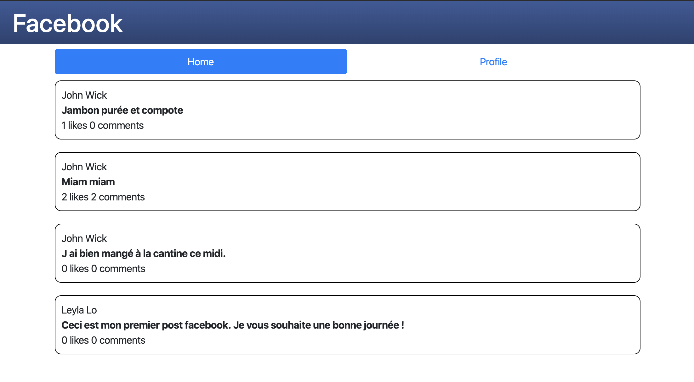

# FB light

Fb light is a small project example using express, postgres, node-postress and bootstrap.



## Installation

You must hase installed [node](https://nodejs.org/en/) and [npm](https://www.npmjs.com/get-npm) to run this project.

You can setup the database from the file `init_database.sql`.

To install the dependecies, run the following command a the project root:
```bash
$ npm install
```

## Usage

Then to run the project:
```bash
$ npm run start
```
Then visit [localhost:3000](http://localhost:3000).

## Contributing
Pull requests are welcome. For major changes, please open an issue first to discuss what you would like to change.

## License
[MIT](https://choosealicense.com/licenses/mit/)